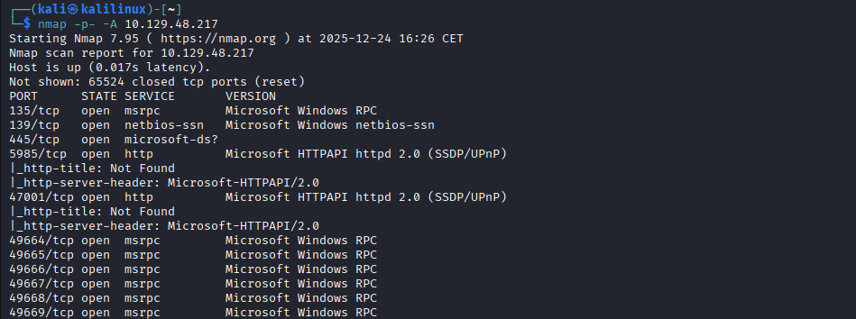

# Dancing

`SMB` est l’acronyme de `Sever Message Block` sont port par défaut est le `445`, ce protocole sert à **partager des ressources** sur un réseau. Il permet principalement d'accéder à des **fichiers** et des dossiers distants comme s'ils étaient locaux, de partager des **imprimantes** entre plusieurs postes et d'assurer la **communication** entre différents logiciels sur le réseau. C'est le langage standard pour faire discuter les ordinateurs Windows entre eux.

J’effectue un scan nmap pour lister les services actif sur la cible, j’utilise le flag `-A` qui englobe plusieurs flags intéressent et le flag `-p-` qui permet de scanner tout les ports.

Sur le port `445`, on trouve un service nommé `microsoft-ds` qui désigne le protocole `SMB`. 

`SMB` est l’acronyme de `Sever Message Block` sont port par défaut est le `445`, ce protocole sert à **partager des ressources** sur un réseau. 

Il permet principalement d'accéder à des **fichiers** et des dossiers distants comme s'ils étaient locaux, de partager des **imprimantes** entre plusieurs postes et d'assurer la **communication** entre différents logiciels sur le réseau. C'est le langage standard pour faire discuter les ordinateurs Windows entre eux.

Tout comme un serveur **`FTP**` permet parfois une connexion avec l'utilisateur `anonymous` sans mot de passe, le service **`SMB`** sur cette machine est configuré pour accepter les **"`Null Sessions`"**.

Pour lister les partages disponibles, on utilise le flag **`-L`** (pour *List*). On peut alors omettre le mot de passe soit en utilisant le flag **`-N`** (pour *No password*), soit en appuyant simplement sur **Entrée** lors de la requête.

On peut constater quatre **Sharename** : un Sharename est le nom d'une ressource (dossier ou imprimante) partagée sur le réseau via le protocole `SMB`. 

La seule ressource à laquelle je peux accéder ici est **`WorkShares`**. On remarque l'absence du signe **`$`** à la fin de son nom, contrairement aux partages `ADMIN$` ou `C$`, ce qui indique qu'il s'agit d'un partage utilisateur public et non d'un partage administratif réservé aux administrateurs du système.

Voici comment accéder a une ressource.

L'interface interactive de `smbclient` est comme un terminal **Linux plus rigide** . Pour récupérer un fichier, on utilise la commande **`get`**, qui télécharge le document depuis le serveur vers le **répertoire courant** de ta machine, exactement comme sur un serveur **`FTP`**.

