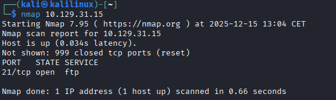

# FAWN

Dans un premier temps, j’effectue un scan Nmap afin d’identifier les services exposés :

On observe que sur le port **21**, il y a un service `ftp`, acronyme de *File Transfer Protocol*.

Le port **21** est le port par défaut de ce service.

Le protocole `ftp` transfère les données **sans chiffrement**.

La version chiffrée est `sftp`, acronyme de *SSH File Transfer Protocol*, qui écoute par défaut sur le port **22**.

---

Je relance ensuite un scan Nmap afin d’identifier la version du service `ftp` à l’aide du flag `-sV` :

La version du service identifiée est **`vsftpd 3.0.3`**.

Grâce au flag `-sV`, j’obtiens des informations détaillées sur les services ainsi que sur le système d’exploitation.

Pour obtenir encore plus de détails sur l’OS, je peux ajouter le flag `-O` :

---

Je peux me connecter au service FTP en tant qu’invité, sans mot de passe, grâce à l’utilisateur `anonymous`.

Il suffit d’omettre le mot de passe ou d’en saisir un quelconque :

Je reçois un code de réponse **`230`**, indiquant que l’authentification a réussi (*Login successful*).

---

J’utilise ensuite les commandes `ls` ou `dir` pour lister les fichiers et dossiers présents sur le serveur.

Puis, j’utilise la commande `get`, suivie du nom du fichier, afin de le télécharger sur ma machine.

Le fichier est téléchargé dans le répertoire courant depuis lequel je me connecte au service FTP :

---

Je quitte la session FTP à l’aide de la commande `exit`.

Je constate ensuite que le fichier a bien été transféré sur ma machine.

Il ne me reste plus qu’à récupérer le flag :

